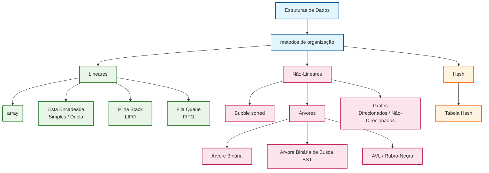

```mermaid
flowchart TD
    A[Estruturas de Dados] --> A1[metodos de organização] --> B[Lineares]
    A1 --> C[Não-Lineares]
    A1 --> D[Hash]
    
    B --> B1(array)
    
    
    B --> B2[Lista Encadeada<br>Simples / Dupla]
    B --> B3[Pilha Stack<br>LIFO]
    B --> B4[Fila Queue<br>FIFO]

	C --> bs[Bubble sorted]
    C --> C1[Árvores]
    C1 --> C1a[Árvore Binária]
    C1 --> C1b[Árvore Binária de Busca BST]
    C1 --> C1c[AVL / Rubro-Negra]

    C --> C2[Grafos<br>Direcionados / Não-Direcionados]

    D --> D1[Tabela Hash]
    
    %% Links clicáveis - ADICIONE ESTA LINHA
        
        click B1 "[array.md](obsidian://open?vault=Obsidian%20Vault&file=estrutura%20de%20dados%2Farray)" "lsita sobre arrays"
         
    
    %% Estilos
    classDef default fill:#e1f5fe,stroke:#01579b,stroke-width:2px;
    classDef linear fill:#e8f5e8,stroke:#2e7d32;
    classDef nonLinear fill:#fce4ec,stroke:#c2185b;
    classDef hash fill:#fff3e0,stroke:#ff6810;
    
    class B,B1,B2,B3,B4 linear;
    class C,C1,C1a,C1b,C1c,C2,bs nonLinear;
    class D,D1 hash;
```
- [[array]] - Estruturas de dados array
- [[metodos deorganização/Bubble sorted|Bubble sorted]]
