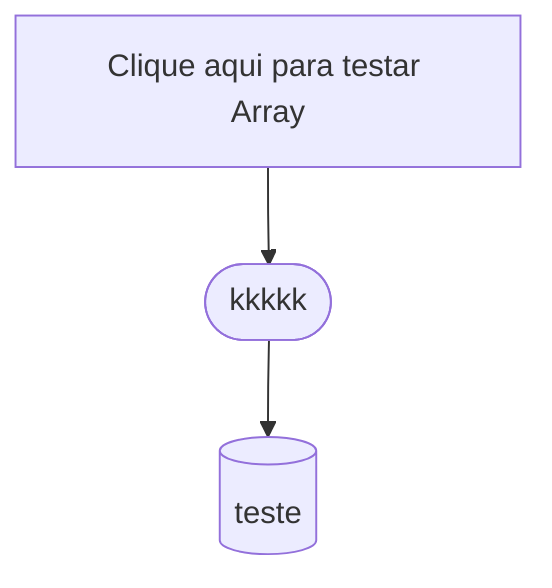

# Teste de Links Mermaid

```mermaid
flowchart TD
    Teste[Clique aqui para testar Array]
    
    click Teste "[[array]]" "Teste"
    Teste --> ts([kkkkk]) --> ts2[(teste)]
    
```

**Link manual para comparação:**
- [[array]]