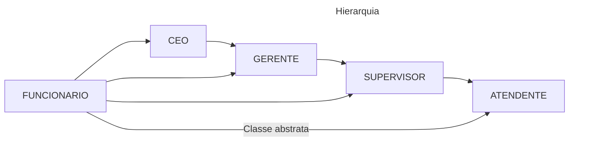

```mermaid
graph LR
    %% Definição do Nó Principal
    F[FUNCIONARIO]

    %% Subgrafo para alinhar os cargos verticalmente
    subgraph Hierarquia
        direction TB
        C[CEO]
        G[GERENTE]
        S[SUPERVISOR]
        A[ATENDENTE]

        %% Conexões verticais entre os cargos
        C --> G
        G --> S
        S --> A
    end

    %% Conexões do Funcionario para os cargos
    F --> C
    F --> G
    F --> S
    F --> |Classe abstrata| A

  
    
    %% Remover borda do subgrafo para ficar invisível
    style Hierarquia fill:transparent,stroke:none
```
    Permições:  
  
Atendente:  
- tirar ferias  
- fazer ligaçẽos  
- agendar horarios